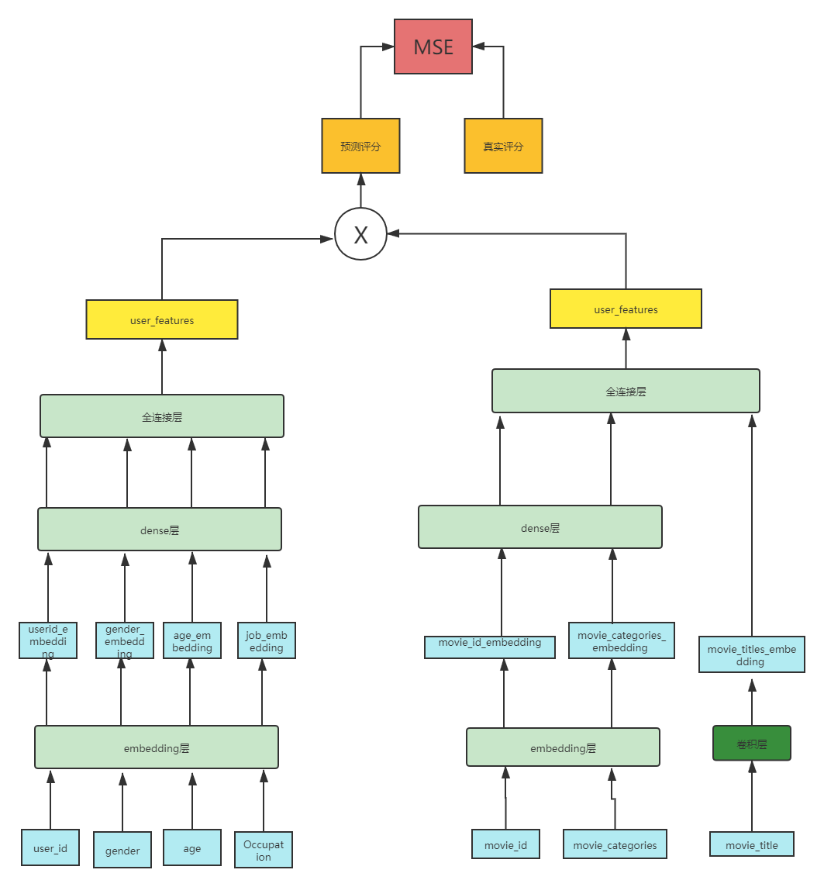

# 模型介绍

**这是一个简单的电影推荐系统，应用了文本卷积网络实现电影名字的嵌入表示，以达到好的推荐效果**

数据集是公开的MovieLens数据集，主要有用户数据，电影数据，评分数据三个dat文件

- 用户数据集：用户ID，性别，年龄，职业，邮编（这一项在形成用户特征时不要）

- 电影数据集：电影ID，标题，类别（一个电影可能属于多个类别）

- 评分数据集：用户ID，电影ID，评分（0-5），时间戳（不要）

  

**数据预处理**

- 用户

  - 性别映射为0,1
  - 年龄
    - 1: "Under 18"----->0
    - 18: "18-24"-------->1
    - 25: "25-34"-------->2
    - 35: "35-44"-------->3
    - 45: "45-49"-------->4
    - 50: "50-55"-------->5
    - 56: "56+"---------->6

- 电影

  - 类别：一共18种，长度统一填充为18，不够的补‘<PAD>': 8

    - |                    |
      | ------------------ |
      | 'Action': 4,       |
      | 'Adventure': 6,    |
      | 'Animation': 14,   |
      | "Children's": 3,   |
      | 'Comedy': 17,      |
      | 'Crime': 15,       |
      | 'Documentary': 12, |
      | 'Drama': 18,       |
      | 'Fantasy': 7,      |
      | 'Film-Noir': 1,    |
      | 'Horror': 0,       |
      | 'Musical': 13,     |
      | 'Mystery': 11,     |
      | 'Romance': 16,     |
      | 'Sci-Fi': 9,       |
      | 'Thriller': 2,     |
      | 'War': 10,         |
      | 'Western': 5}      |

  - 电影名：统计电影名里的所有单词，每个单词映射为一个数字，把电影名转成对应的数字，长度统一为15，不够的填充

**框架图**

